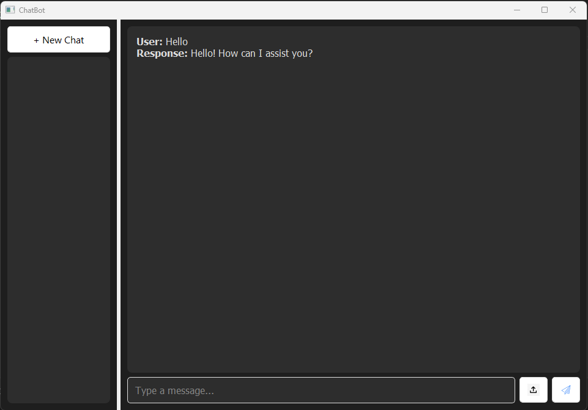

# A ChatGPT like UI using PyQT5

# Functionalities

1. ChatGPT Like UI
2. You can chat and upload your documents 

# Further Updates

1. A New Chat window
2. Chat History Storage
3. LLM Functionality